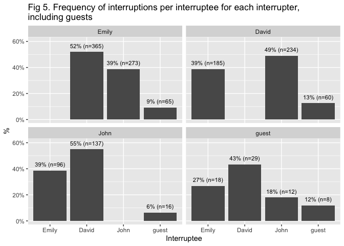

Gabfest interruptions
================
Lindsay Lee
2021-10-01

Analysis on 55 episodes from 2016-06-17 to 2017-06-08.

Definition of an “interruption”:

-   one person talks over another with the purpose of making their own
    point
-   may or may not cause the other person to stop talking
-   excludes exclamations or conversational modes of emphasis (eg
    “right,” “yeah,” “that’s interesting”)

# Ignoring guest interruptions

<!-- -->

<!-- -->

<!-- -->

# Including guest interruptions

<!-- -->

<!-- -->

<!-- -->
